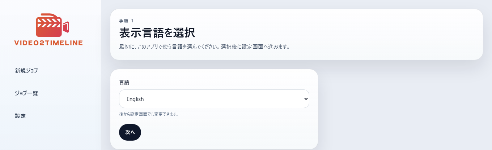
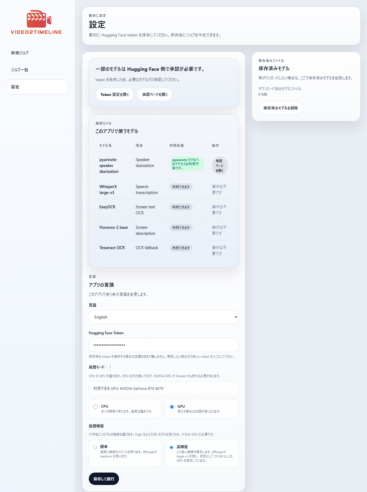
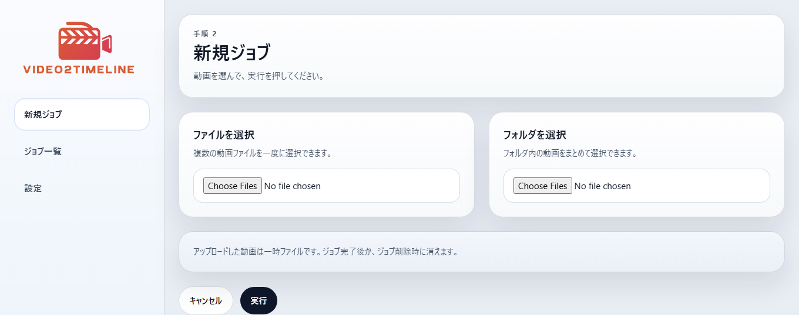
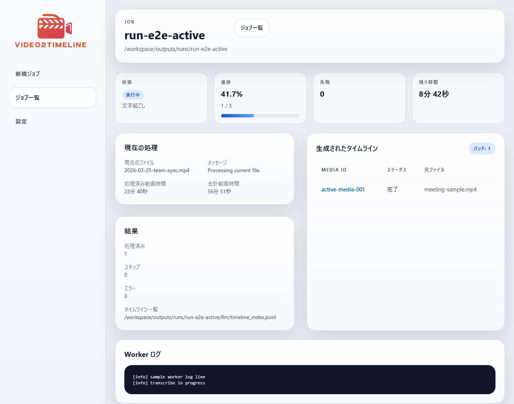

# video2timeline

手元にある動画ファイルを、ChatGPT などの LLM に渡しやすいタイムライン資料へ変換するローカルアプリです。

[English README](README.md) | [サンプルタイムライン](docs/examples/sample-timeline.ja.md) | [第三者ライセンス](THIRD_PARTY_NOTICES.md) | [モデルと実行メモ](MODEL_AND_RUNTIME_NOTES.md) | [セキュリティと安全性](docs/SECURITY_AND_SAFETY.md) | [公開前チェック](docs/PUBLIC_RELEASE_CHECKLIST.md) | [ライセンス](LICENSE)

## 目的

`video2timeline` の目的はシンプルです。

1. 手元の動画ファイルを選ぶ
2. ローカルで処理する
3. ZIP をダウンロードする
4. その ZIP を ChatGPT や他の LLM に渡す

用途の例:

- 会議の振り返り
- 会話履歴の整理
- 家族や友人との会話の見直し
- 画面録画の振り返り
- 古い動画資産のテキスト化

## スクリーンショット

### 言語選択



### 設定



### 新しいジョブ



### ジョブ一覧


### ジョブ詳細



## 何が出力されるか

一番見るべきファイルは、各動画ごとの `timeline.md` です。

そのほかに、必要に応じて次の補助ファイルも出力されます。

- `raw.json` と `raw.md`
- 画面メモと画面差分
- 内部で無音カットした場合の `cut_map.json`
- LLM 向けの `batch-*.md` と `timeline_index.jsonl`

ChatGPT に渡す素材が欲しいだけなら、ジョブ完了後にアプリから ZIP をダウンロードしてください。

## クイックスタート

Windows:

```powershell
.\start.bat
```

macOS:

```bash
./start.command
```

起動後の流れ:

1. 言語を選ぶ
2. `Settings` を開く
3. 話者分離を使いたい場合は Hugging Face token を保存する
4. `CPU` または `GPU` を選ぶ
5. 処理精度を選ぶ
6. 新しいジョブを作る
7. 処理完了を待つ
8. ZIP をダウンロードする

`start.bat` / `start.command` は、まず Google Chrome、Microsoft Edge、Brave、Chromium のいずれかで専用ウィンドウ風に開こうとします。使えない場合は通常のブラウザで開きます。

## 必要なもの

- Windows または macOS
- Docker Desktop
- 初回のコンテナ・モデル取得用のインターネット接続
- `pyannote` 話者分離を使う場合の Hugging Face token
- `pyannote` の利用承認
- GPU モードを使う場合は NVIDIA GPU と Docker GPU 対応

## 計算モード

- `CPU`
  - 多くの環境で動く
  - 速度は遅め
- `GPU`
  - Docker から NVIDIA GPU が見える必要がある
  - 主な推論処理が高速になる

処理精度:

- `Standard`
  - `WhisperX medium`
- `High`
  - `WhisperX large-v3`
  - GPU モードかつ十分な VRAM がある場合のみ利用可能

この開発環境では `NVIDIA GeForce RTX 4070` で GPU 実行を確認しています。

## 対応入力形式

主な対応形式:

- `.mp4`
- `.mov`
- `.m4v`
- `.avi`
- `.mkv`
- `.webm`

実際に読めるかどうかは、ランタイム内の `ffmpeg` に依存します。

## 多言語対応

対応言語:

- `en`
- `ja`
- `zh-CN`
- `zh-TW`
- `ko`
- `es`
- `fr`
- `de`
- `pt`

初回起動時の既定言語は英語です。選択した言語は `.env` ではなく、アプリ設定データに保存されます。

## CLI

通常利用は GUI が前提です。CLI はスクリプト実行や直接操作向けです。

主なコマンド:

- `settings status`
- `settings save`
- `jobs create`
- `jobs list`
- `jobs show`
- `jobs run`
- `jobs archive`

例:

```powershell
$env:PYTHONPATH=".\worker\src"
python -m video2timeline_worker settings status
python -m video2timeline_worker settings save --token hf_xxx --terms-confirmed
python -m video2timeline_worker jobs create --file C:\path\to\clip.mp4
python -m video2timeline_worker jobs create --directory C:\path\to\folder
python -m video2timeline_worker jobs list
python -m video2timeline_worker jobs archive --job-id run-YYYYMMDD-HHMMSS-xxxx
```

CLI でも ZIP 形式の受け渡しに寄せたい場合は、完了後に `jobs archive` を使ってください。

## 出力構成

```text
run-YYYYMMDD-HHMMSS-xxxx/
  request.json
  status.json
  result.json
  manifest.json
  RUN_INFO.md
  TRANSCRIPTION_INFO.md
  NOTICE.md
  logs/
    worker.log
  media/
    <media-id>/
      source.json
      audio/
        extracted.mp3
        trimmed.mp3
        cut_map.json
      transcript/
        raw.json
        raw.md
      screen/
        screenshot_01.jpg
        screenshots.jsonl
        screen_diff.jsonl
      timeline/
        timeline.md
  llm/
    timeline_index.jsonl
    batch-001.md
```

## テスト

今のテストは必要十分な範囲に絞っています。

- Python worker の unit test
- ASP.NET Core UI の Playwright ベース smoke test
- 実データでの手動 smoke test

worker の unit test:

```powershell
$env:PYTHONPATH=".\worker\src"
python -m unittest discover .\worker\tests
```

ブラウザ E2E:

```powershell
.\scripts\test-e2e.ps1
```

commit 時の lint を有効にする場合:

```powershell
git config core.hooksPath .githooks
```

## ライセンス

このリポジトリは MIT License です。詳細は [LICENSE](LICENSE) を参照してください。
