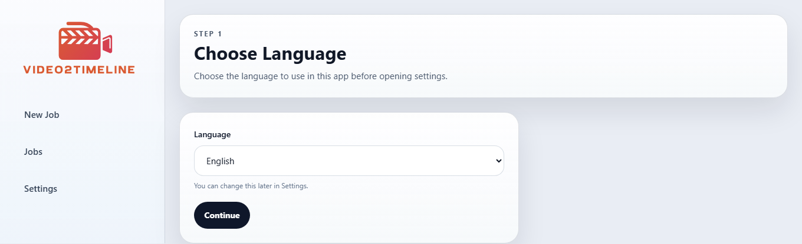
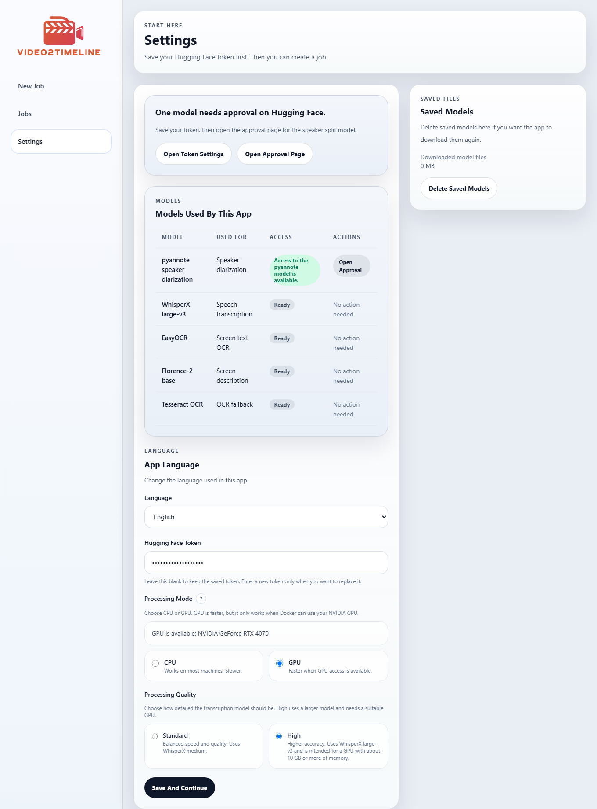

# video2timeline

Turn local video files into timeline packages that are easier to review, zip, and hand to ChatGPT or other LLM workflows.

[Japanese README](README.ja.md) | [Sample Timeline](docs/examples/sample-timeline.en.md) | [Third-Party Notices](THIRD_PARTY_NOTICES.md) | [Model and Runtime Notes](MODEL_AND_RUNTIME_NOTES.md) | [Security And Safety](docs/SECURITY_AND_SAFETY.md) | [Release Checklist](docs/PUBLIC_RELEASE_CHECKLIST.md) | [License](LICENSE)

## Purpose

`video2timeline` is built for a simple workflow:

1. pick video files you already have
2. run local processing
3. download a ZIP package
4. upload that ZIP to ChatGPT or another LLM for analysis

This is useful for:

- meeting review
- conversation history analysis
- family or friend conversation review
- screen recording review
- turning old video archives into structured text materials

## Screenshots

### Language



### Settings



### New Job


### Jobs


### Job Details


## What You Get

The main file to read is each media item's `timeline.md`.

Each completed job also includes supporting files such as:

- `raw.json` and `raw.md`
- screen notes and screen diffs
- `cut_map.json` when silence trimming was used internally
- `batch-*.md` and `timeline_index.jsonl` for LLM-facing export

If you only need something to upload to ChatGPT, use the ZIP download from the app after a job completes.

## Quick Start

Windows:

```powershell
.\start.bat
```

macOS:

```bash
./start.command
```

Then:

1. choose your language
2. open `Settings`
3. save your Hugging Face token if you want diarization
4. choose `CPU` or `GPU`
5. choose processing quality
6. create a new job
7. wait for processing to finish
8. download the ZIP package

The start script tries to open a dedicated app-style window with Google Chrome, Microsoft Edge, Brave, or Chromium. If none of those are available, it falls back to a normal browser window.

## Requirements

- Windows or macOS
- Docker Desktop
- internet access on first run for container and model downloads
- optional Hugging Face token for `pyannote` diarization
- required gated-model approval for `pyannote`
- NVIDIA GPU plus Docker GPU access if you want GPU mode

## Compute Modes

- `CPU`
  - works on more machines
  - slower
- `GPU`
  - requires NVIDIA GPU support inside Docker
  - faster for the main ML workloads

Processing quality:

- `Standard`
  - `WhisperX medium`
- `High`
  - `WhisperX large-v3`
  - available only when GPU mode is enabled and enough VRAM is detected

In this development environment, GPU execution was verified on `NVIDIA GeForce RTX 4070` with Docker GPU access.

## Supported Input Formats

Primary support:

- `.mp4`
- `.mov`
- `.m4v`
- `.avi`
- `.mkv`
- `.webm`

Actual decoding still depends on the `ffmpeg` build inside the runtime image.

## Localization

Supported locales:

- `en`
- `ja`
- `zh-CN`
- `zh-TW`
- `ko`
- `es`
- `fr`
- `de`
- `pt`

English is the default on first launch. The selected language is stored in the app settings data, not in `.env`.

## CLI

The GUI is the main entry point. A worker CLI is also available for scripting and direct local execution.

Common commands:

- `settings status`
- `settings save`
- `jobs create`
- `jobs list`
- `jobs show`
- `jobs run`
- `jobs archive`

Example:

```powershell
$env:PYTHONPATH=".\worker\src"
python -m video2timeline_worker settings status
python -m video2timeline_worker settings save --token hf_xxx --terms-confirmed
python -m video2timeline_worker jobs create --file C:\path\to\clip.mp4
python -m video2timeline_worker jobs create --directory C:\path\to\folder
python -m video2timeline_worker jobs list
python -m video2timeline_worker jobs archive --job-id run-YYYYMMDD-HHMMSS-xxxx
```

Use `jobs archive` after a completed run if you want the CLI flow to produce the same ZIP-style handoff used by the GUI.

## Output Layout

```text
run-YYYYMMDD-HHMMSS-xxxx/
  request.json
  status.json
  result.json
  manifest.json
  RUN_INFO.md
  TRANSCRIPTION_INFO.md
  NOTICE.md
  logs/
    worker.log
  media/
    <media-id>/
      source.json
      audio/
        extracted.mp3
        trimmed.mp3
        cut_map.json
      transcript/
        raw.json
        raw.md
      screen/
        screenshot_01.jpg
        screenshots.jsonl
        screen_diff.jsonl
      timeline/
        timeline.md
  llm/
    timeline_index.jsonl
    batch-001.md
```

## Testing

Current test coverage is intentionally lightweight:

- Python worker unit tests
- Playwright-based E2E smoke tests for the ASP.NET Core UI
- manual smoke runs with real local jobs

Run worker unit tests:

```powershell
$env:PYTHONPATH=".\worker\src"
python -m unittest discover .\worker\tests
```

Run browser E2E tests:

```powershell
.\scripts\test-e2e.ps1
```

Enable commit-time lint checks:

```powershell
git config core.hooksPath .githooks
```

## License

This repository is licensed under the MIT License. See [LICENSE](LICENSE).
